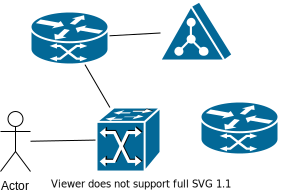

# Klassen Code und Diagramm


## untereinander3




```java
public class Tier {
    private String name;
    private double gewicht;

    public Tier(String name)
    {
        this.name=name;
    }
    public String getName(){
        return name;
    }
    public double getGewicht(){
        return gewicht;
    }
    public void setGewicht(double gewicht){
        this.gewicht=gewicht;
    }
}
```


## nebeneinander


```java
public class Tier {
    private String name;
    private double gewicht;

    public Tier(String name)
    {
        this.name=name;
    }
    public String getName(){
        return name;
    }
    public double getGewicht(){
        return gewicht;
    }
    public void setGewicht(double gewicht){
        this.gewicht=gewicht;
    }
}
```
<br clear="left"/>


## Weiter im Text!
