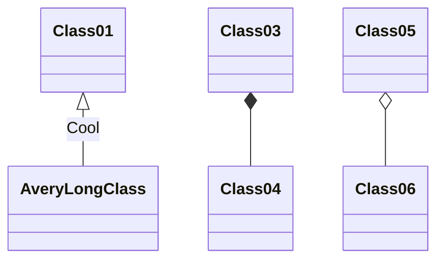

#  Beispiel!
Wir schwitzen im Raum **2.13** !!


## Code einbauen!!
 



```java
/**
 * Main
 */
public class Main {

    public static void main(String[] args) {
        System.out.println("Hallo Welt!");
    }
}
```