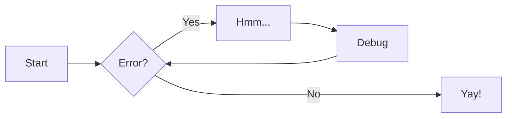

#  Beispiele!!

## Ein Bild einfügen


## PlantUML einfügen


## Code einbauen!!

```java
/**
 * Main
 */
public class Main {

    public static void main(String[] args) {
        System.out.println("Hallo Welt!");
    }
}
```

## LaTex Formeln verwenden


|Beschreibung| |
------ | -----
$A \sim B$   bedeutet $\vert  A \vert =  \vert  B \vert$ | Äquivalenz von Mengen
$A = B$   bedeutet $x \in A \leftrightarrow x \in B$ | Gleichheit von Mengen
$A \subseteq B$   bedeutet $x \in A \rightarrow x \in B$ | Differenzmenge

## Meramaid Grafiken verwenden


